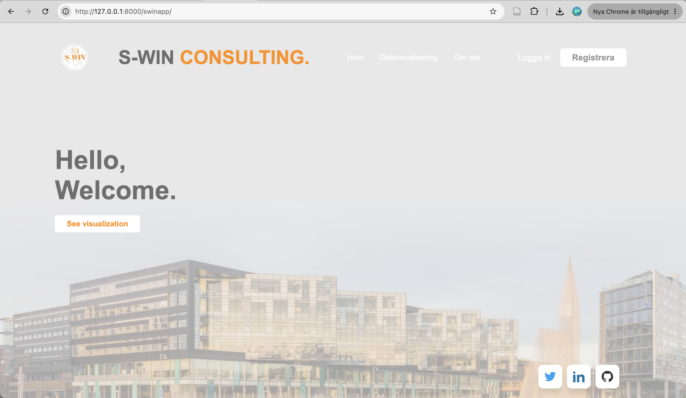
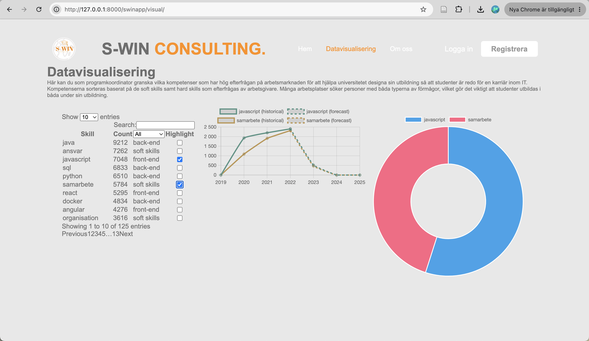
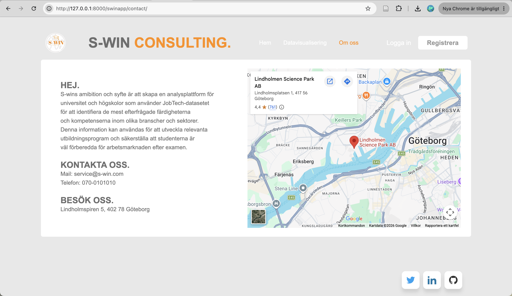

# S-WIN

S-WIN is a web-based analytics platform developed as a university project. The purpose of the platform is to analyse labour market data and identify skills that are in high demand, helping universities and educational institutions adapt their programmes to current and future industry needs.

## Features

* Interactive data visualisation
* Analysis of labour market skill trends
* Comparison of technical and soft skills
* Search and filtering functionality
* Web-based user interface

## Technologies

* Python
* Django
* JavaScript
* HTML
* CSS
* SQLite

## Screenshots

### Landing page



### Data visualization



### About page



## Running the project locally

1. Install Django

```bash
pip install django
```

2. Start the development server

```bash
python manage.py runserver
```

3. Open your browser and navigate to:

```text
http://127.0.0.1:8000/swinapp/
```

## Project Background

The project was developed as part of university studies and demonstrates full-stack web development, data visualisation, database integration and basic analytics using labour market data.
